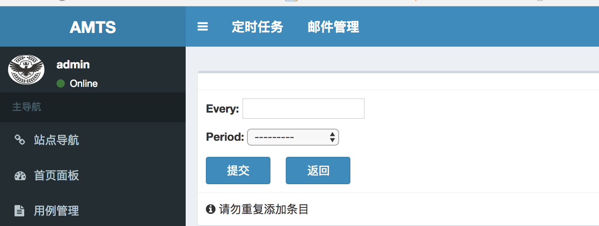

# 自动化平台AutoPlatMS部署与使用
#### 一、平台简介
> 	AutoPlatMS(全称：Auto Platform Manager System，自动化平台管理系统)，设计的初衷是希望用平台化来做接口的自动化测试，从各种各样的接口工具中解放出来，不需要安装，提供统一的服务，每个人都可以去做接口的调试与自动化构建。

平台功能：

- 支持单个接口或者多个接口批量运行
- 支持组管理多个接口
- 支持组或者接口采用代理访问
- 支持http协议GET，POST请求
- 支持定时任务执行接口
- 支持html报告在线查看
- 支持邮件告警发送报告
- 支持mock功能
- 支持用户管理
- 支持数据库管理
- 支持邮件管理
- 支持失败重跑

#### 二、软件信息
- mysql(5.7.16)
- redis(4.0.2)
- python(3.6.4)
- python依赖库
	- Django==1.11.12
	- requests==2.18.1
	- kombu==3.0.37
	- pytz==2017.3
	- celery==3.1.25
	- django_celery==3.2.2
	- djangorestframework==3.8.2
	- simplejson==3.15.0

#### 三、环境部署
1、安装*mysql*数据库，设置*utf-8*编码，创建*atms*数据库

```shell
 #A. 创建数据库并设置编码：
create database atms character set utf8 collate utf8_general_ci;
 #B. 查看当前编码：
show variables like 'character_set_database';
 #C.删除数据库：
drop database atms;
```
2、修改**AutoPlatMS.conf**中**mysql**信息

```shell
[db]
engine = mysql
host = 127.0.0.1
port = 3306
user = root
password = 123456
database = atms
```
3、安装*python3*,直接搜索下载安装即可

4、安装平台运行*python*依赖包

``` shell
# cd 进入项目AutoPlatMS的根目录下，执行
python3 -m pip install requirements.txt
```
5、安装启动*redis*

``` shell
# mac 下载安装，linux下wget换成apt-get
$ wget http://download.redis.io/releases/redis-4.0.2.tar.gz
$ tar xzf redis-4.0.2.tar.gz
$ cd redis-4.0.2
$ make
# 运行
$ src/redis-server
```
6、数据库表创建生成与同步

``` shell
# 生成数据库表py文件，项目根目录下执行
$ python3 manage.py makemigrations
# 执行py文件并同步到数据库，项目根目录下执行
$ python3 manage.py migrate
``` 
7、项目根目录执行 *python3 manage.py createsuperuser* 根据提示输入用户名，邮箱，密码
8、配置*celery*定时任务*redis*地址

``` 
# 打开项目根目录下文件AutoPlatMS/settings.py
BROKER_URL = 'redis://localhost:6379/0'
#或者
CELERY_BROKER_URL = 'redis://localhost:6379/0'
``` 
9、项目根目录执行 *python3 manage.py runserver* 启动服务

#### 四、使用手册
##### 接口运行流程介绍
1、登录后进入**用例管理>>用例集管理**页面，先添加用例集管理


2、进入**用例管理>>接口管理**，添加接口,**用例属组**即可选择第一步添加的用例集


3、第二步添加接口成功后，在**接口管理**页面可编辑运行，可以选择批量运行也可以在**用例集管理**界面单独运行某一个集合中的接口


4、查看某一个接口的详情


##### mock运行流程介绍
> mock 功能主要是对http协议的接口进行模拟，设置预期响应，从而进行访问。

1、登录后进入**Mock管理>>属组管理**页面，先添加属组


2、然后进入**Mock接口管理**页面，添加mock接口


3、添加成功后，可以查看mock列表


4、运行单个mock接口，可以检查mock是否配置成功


##### 定时任务
> 定时任务模块，可以使用后台的定时触发规则来进行接口的定时构建，从而实现自动化，并可在构建失败发送邮件告警，查看执行结果。

1、在添加接口用例后，即可进行定时任务创建，先添加定时间隔或者定时周期，二选一
1)定时间隔添加
```
间隔单位：毫秒，秒，分钟，小时，天
```



2）定时间隔列表


3) 定时周期添加

```
   * : 代表任意1, 当定时周期都为*， 表示每隔一分钟;
   */3: 每隔3, 比如 Minute: */3 表示每隔三分钟;
	如果为具体数字则表示当前设定时间, 比如：Hour：9，表示早上9点;
```


4）定时周期列表


2、定时任务添加

```
1）模板名称可以直接填写已经注册的模板，
   也可以不填写，在下面选择模板处选择即可。
2）定时周期和定时间隔，二选一即可。
3）任务参数和任务指令根据实际task要求去传值，
   比如运行用例集模板runCaseGroup，
   直接传任务参数：["组1"]，任务指令默认即可。
```


3、定时任务列表

```
1) 任务状态栏可以查看当前任务状态；
2）最新报告在定时任务运行完成后方可查看
```


4、任务结果可以查看每次定时任务的结果详情


5、定时构建失败后发送邮件

1）系统配置-邮件管理-添加发件人


2）系统配置-邮件管理-发件人列表


3) 定时任务-邮件管理-添加邮件

```
构建失败发送邮件可以选择绑定到具体的定时任务和发件人
```


4) 定时任务-邮件管理-邮件列表


##### 用户管理

> 通过用户管理模块，可以添加使用此平台的用户，区分角色：管理员/普通用户，通过给不同角色分配权限，可以限制角色对某些页面的访问

1、添加用户


2、用户列表


3、添加角色


4、角色列表


5、添加权限


6、权限列表


